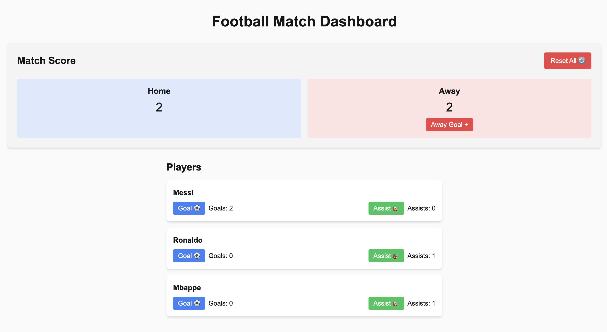

# Football Dashboard with Next.js and Jotai

A real-time football match dashboard built with Next.js and Jotai for state management. Track scores, player statistics, and match events in an interactive interface.

## Demo



## Features

- Real-time match scoreboard
- Player statistics tracking (goals and assists)
- Individual player cards with action buttons
- Global state management with Jotai
- Responsive design with Tailwind CSS

## Tech Stack

- [Next.js](https://nextjs.org/) - React framework
- [Jotai](https://jotai.org/) - Primitive and flexible state management
- [TypeScript](https://www.typescriptlang.org/) - Type safety
- [Tailwind CSS](https://tailwindcss.com/) - Styling
- [ESLint](https://eslint.org/) - Code linting
- [Prettier](https://prettier.io/) - Code formatting

## Getting Started

First, run the development server:

```bash
npm run dev
# or
yarn dev
# or
pnpm dev
# or
bun dev
```

Open [http://localhost:3000](http://localhost:3000) with your browser to see the result.

## Project Structure

```
├── app/
│ ├── layout.tsx # Root layout with Jotai Provider
│ ├── page.tsx # Main dashboard page
│ └── globals.css # Global styles
├── atoms/
│ └── footballAtoms.ts # Jotai atoms for state management
├── components/
│ ├── PlayerCard.tsx # Individual player statistics
│ └── Scoreboard.tsx # Match scoreboard
└── public/
```

## State Management

This project uses Jotai for state management, featuring:

- Atom families for player statistics
- Derived atoms for total score calculations
- Write-only atoms for reset functionality
- Global match state management
